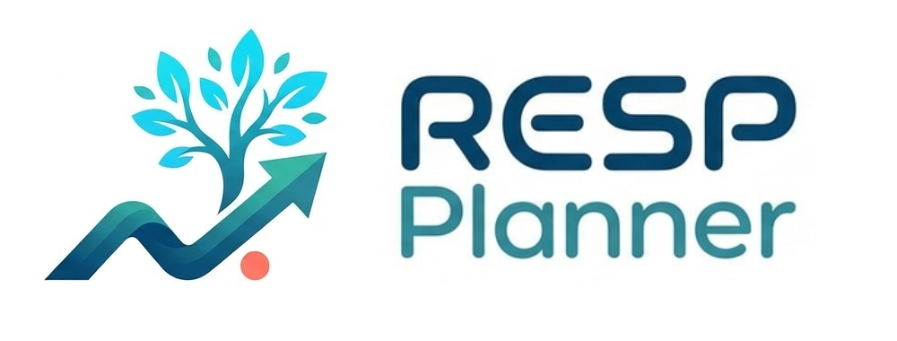

<p align="center">
  
</p>

<p align="center">
  A comprehensive RESP (Registered Education Savings Plan) planning tool for Canadian families.
</p>

---

Plan and optimize your children's education savings with contribution tracking, government grants, and investment projections.

## Features

### Core Features

- **Child Management**: Track multiple children with RESP beneficiary details
- **Contribution Planning**: Create detailed year-by-year contribution schedules
- **Grant Optimization**: Automatic calculation of CESG, ACESG, and CLB grants
- **Portfolio Management**: Configure ETF allocations and track blended returns
- **Projection Engine**: Project future RESP values with customizable return rates
- **Plan Comparison**: Compare different contribution strategies side-by-side
- **Quick Start Wizard**: Get set up quickly with guided setup flow
- **Data Export/Import**: Export and import data as JSON
- **Print View**: Generate print-friendly plan summaries
- **Dark Mode**: Full dark mode support

### SEO & Deployment

- **Dynamic OG Images**: Auto-generated Open Graph images for social sharing
- **SEO Optimized**: Sitemap, robots.txt, and meta tags
- **Security Headers**: X-Frame-Options, X-Content-Type-Options, Referrer-Policy
- **Docker Support**: Production-ready Docker configuration
- **Vercel Ready**: Optimized for Vercel deployment
- **Analytics**: Vercel Analytics integration

## Tech Stack

- **Framework**: Next.js 16 with App Router
- **Language**: TypeScript (strict mode)
- **Styling**: Tailwind CSS
- **UI Components**: shadcn/ui
- **State Management**: Zustand with localStorage persistence
- **Validation**: Zod
- **Icons**: Lucide React
- **Date Handling**: date-fns

## Getting Started

### Prerequisites

- Node.js 18+
- pnpm 8+

### Installation

1. Clone the repository:

```bash
git clone https://github.com/thangk/resp-planner.git
cd resp-planner
```

2. Install dependencies:

```bash
pnpm install
```

3. Run the development server:

```bash
pnpm dev
```

4. Open [http://localhost:3000](http://localhost:3000) in your browser.

### Build for Production

```bash
pnpm build
pnpm start
```

### Docker

Build and run with Docker Compose (runs on port 3001):

```bash
docker compose up --build
```

Or build manually (port 3001 maps to container's 3000):

```bash
docker build -t resp-planner .
docker run -p 3001:3000 resp-planner
```

## Project Structure

```
src/
├── app/                    # Next.js App Router pages
│   ├── about/             # About page
│   ├── changelogs/        # Version history
│   ├── children/          # Children management page
│   ├── contact/           # Contact page
│   ├── dashboard/         # Main dashboard
│   ├── plans/             # Plans list and detail pages
│   │   ├── [id]/         # Individual plan view
│   │   ├── compare/      # Plan comparison tool
│   │   └── new/          # New plan creation
│   ├── portfolio/         # ETF portfolio management
│   ├── privacy/           # Privacy policy
│   ├── settings/          # App settings
│   ├── tos/               # Terms of service
│   └── wizard/           # Quick start wizard
├── components/
│   ├── layout/           # Header, sidebar, navigation
│   ├── plans/            # Plan-related components
│   ├── portfolio/        # Portfolio components
│   ├── settings/         # Settings components
│   ├── shared/           # Shared components
│   └── ui/               # shadcn/ui components
├── features/
│   ├── grants/           # Grant calculation logic
│   └── plans/            # Plan projection utilities
├── hooks/                # Custom React hooks
├── lib/                  # Utilities, constants, validators
├── stores/               # Zustand state stores
└── types/                # TypeScript type definitions
```

## Canadian RESP Grant Rules

The app implements the following Canadian government grant programs:

### CESG (Canada Education Savings Grant)

- 20% match on first $2,500/year (up to $500/year)
- Lifetime maximum: $7,200 per beneficiary
- Catch-up: Can claim up to $1,000/year if room available

### ACESG (Additional CESG)

- Extra 10-20% on first $500 based on family income
- Income thresholds adjust annually

### CLB (Canada Learning Bond)

- $500 initial payment + $100/year for eligible families
- Based on family income and child's birth year
- Lifetime maximum: $2,000 per beneficiary

## Data Storage

All data is stored locally in your browser's localStorage. No data is sent to any server. You can:

- **Export**: Download all data as a JSON file
- **Import**: Restore data from a JSON export
- **Clear**: Remove all stored data

## Development

### Linting

```bash
pnpm lint
```

### Type Checking

```bash
pnpm build # Includes TypeScript check
```

### Code Style

The project uses:

- ESLint 9 with flat config
- Prettier for formatting
- Husky for pre-commit hooks

## Author

**Kap Thang**

- Website: [kapthang.dev](https://kapthang.dev)
- Projects: [kapthang.dev/projects](https://kapthang.dev/projects)

## License

This project is proprietary software. All rights reserved.

## Disclaimer

This tool is for educational and planning purposes only. Grant calculations are based on publicly available information about Canadian RESP programs and may not reflect the most current rules. Always consult with a financial advisor and verify grant eligibility with the Canada Revenue Agency (CRA) before making RESP decisions.
